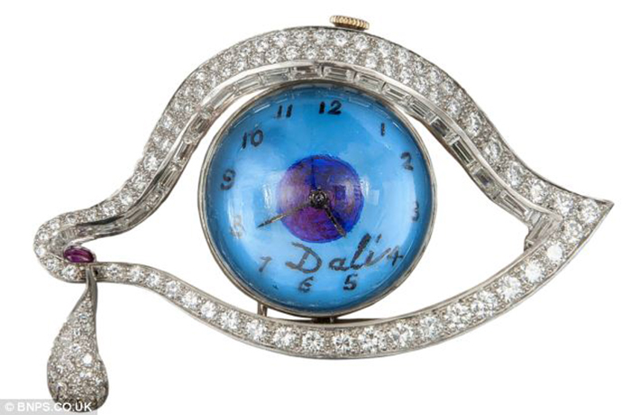
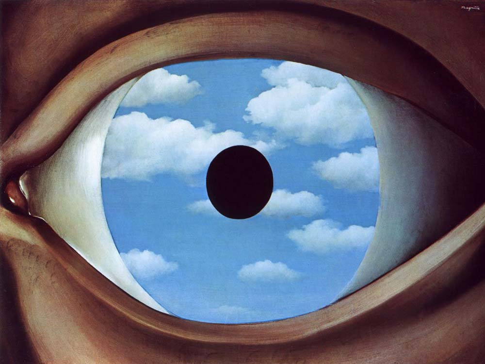

# New born Fortune
## 1.Instructions to Interact
In this animation, users can click on the canvas to generate random eyes on the wheels, and the pupils will follow the mouse. With the generation of eyes, there will simultaneously generate bouncing balls.

These eyes represent the lives in the world, and the mouse represents the creator, so the pupils will follow the creators. And the bouncing balls simulate the cheers for each new born life.
## 2. How to animate individually
**-Using approach: user input**

**-Animated Properties**
Animated properties include the color and elements. I have added more circle elements. And I have used pink and blue as my major colors.

**-Inspirations**
[link text](https://openprocessing.org/sketch/2275129)
This artwork inspires me to create the bouncing balls.

The jewel designed by Dali and the painting created by Rene Magritte make me think of the famous element "evil eye".

However, many jewel designers think "evil eye" contains wishes to avoid misfortune. So I think the new birth should be pure as blue.

**-Technical Explorations**

 **-function bouncingBalls()**

This function was used in my Week 6 Quiz. In that quiz, the balls are floating. I changed them into bouncing the ground.

 **-function drawEyes()**

This functions aims to imitate the eye movement. Calculating the distance between the mouse and eye center and the pupils will move with the mouse.
